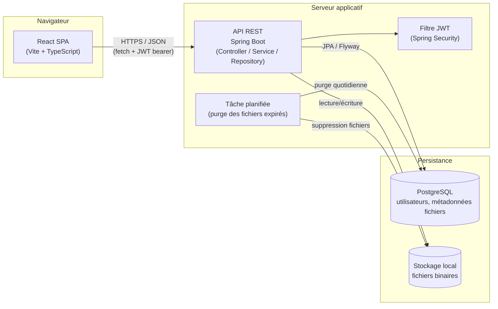

# Architecture — DataShare (MVP)

## Vue d'ensemble

Architecture 3-tiers classique : SPA React qui consomme une API REST Spring Boot,
adossée à une base PostgreSQL et à un stockage de fichiers sur disque local.
Volontairement simple pour un MVP démontrable en local / sur une seule machine.

## Briques techniques

| Brique | Rôle | Techno |
|---|---|---|
| SPA React | UI (login, upload, historique, page de téléchargement publique) | React + Vite + TypeScript |
| API REST | Logique métier, validation, contrôle d'accès | Spring Boot (Web, Security, Validation) |
| Authentification | Génération/validation des JWT, hash des mots de passe | Spring Security + BCrypt + JJWT |
| Base de données | Comptes utilisateurs + métadonnées des fichiers | PostgreSQL (via Spring Data JPA, migrations Flyway) |
| Stockage fichiers | Contenu binaire des fichiers déposés | Système de fichiers local (répertoire dédié, hors webroot) |
| Tâche planifiée | Purge des fichiers expirés (métadonnées + binaire) | `@Scheduled` Spring |

## Flux principaux

- **Upload** : SPA envoie `multipart/form-data` (fichier + options) avec JWT → API valide (taille,
  extension, quotas) → fichier écrit sur disque sous un nom généré (UUID) → ligne créée en base →
  lien de téléchargement (`/d/{id}`) renvoyé au client.
- **Téléchargement** : destinataire ouvre le lien (public, pas de JWT) → SPA appelle `GET /files/{id}/info`
  pour afficher les métadonnées → si mot de passe requis, saisie → `POST /files/{id}/download` renvoie
  le flux binaire.
- **Expiration** : vérifiée à la lecture (`info`/`download` renvoient 410 si expiré) et purgée en tâche
  de fond quotidienne pour libérer le disque et la base.

## Déploiement (local / démo)

Docker Compose lance PostgreSQL (+ volume persistant) ; l'API Spring Boot et la SPA React tournent
en local (`mvn spring-boot:run` / `npm run dev`) pendant la phase MVP. Le détail des scripts est dans
`deploy/` et `MAINTENANCE.md` (à venir).
