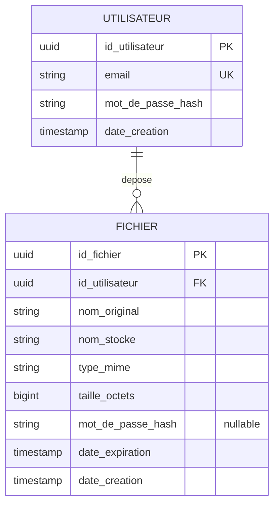

# Modèle de données — DataShare (MVP)

Périmètre MVP (US01–US06) : deux entités suffisent. Les tags (US08) et le lien fichier↔uploadeur
anonyme (US07) sont des extensions optionnelles non modélisées ici (voir *Extensions possibles*).

## MCD (notation Merise)

**Entités**

- **UTILISATEUR** (`id_utilisateur`, `email`, `mot_de_passe_hash`, `date_creation`)
- **FICHIER** (`id_fichier`, `nom_original`, `nom_stocke`, `type_mime`, `taille_octets`,
  `mot_de_passe_hash`, `date_expiration`, `date_creation`)

**Association**

```
UTILISATEUR (1,1) ────< DEPOSE >──── (0,n) FICHIER
```

Lecture : un fichier est déposé par **exactement un** utilisateur (`1,1` — pas d'upload anonyme
dans le MVP) ; un utilisateur dépose **zéro à plusieurs** fichiers (`0,n`).



## MLD / schéma relationnel (PostgreSQL)

**users**

| Colonne | Type | Contraintes |
|---|---|---|
| id | UUID | PK, défaut `gen_random_uuid()` |
| email | VARCHAR(255) | UNIQUE, NOT NULL |
| password_hash | VARCHAR(255) | NOT NULL (BCrypt) |
| created_at | TIMESTAMPTZ | NOT NULL, défaut `now()` |

**files**

| Colonne | Type | Contraintes |
|---|---|---|
| id | UUID | PK, défaut `gen_random_uuid()` — sert aussi de token dans le lien de téléchargement (`/d/{id}`), non prédictible |
| owner_id | UUID | FK → `users(id)`, NOT NULL |
| original_filename | VARCHAR(255) | NOT NULL |
| stored_filename | VARCHAR(255) | NOT NULL — nom sur disque (`{id}.{ext}`), jamais dérivé du nom original (anti path-traversal) |
| content_type | VARCHAR(100) | nullable |
| size_bytes | BIGINT | NOT NULL, ≤ 1 Go (contrôlé applicatif) |
| password_hash | VARCHAR(255) | nullable (BCrypt) — `NULL` = pas de mot de passe sur le fichier |
| expires_at | TIMESTAMPTZ | NOT NULL |
| created_at | TIMESTAMPTZ | NOT NULL, défaut `now()` |

Index : `UNIQUE(email)` sur `users` ; `INDEX(owner_id)` et `INDEX(expires_at)` sur `files`
(le second sert à la fois au job de purge et au calcul du statut "Actif/Expiré" affiché dans
l'onglet *Mes fichiers* des maquettes — ce statut n'est **pas stocké**, il se déduit de
`expires_at > now()` au moment de la requête).

## Règles dérivées des maquettes

- Les onglets **Actifs / Expirés** de l'écran "Mes fichiers" sont un filtre sur `expires_at`,
  pas un champ en base.
- Le champ "Mot de passe" du formulaire d'upload correspond à `files.password_hash` — distinct du
  mot de passe du compte (`users.password_hash`). Un fichier peut être protégé par mot de passe
  même si son propriétaire est connecté (US01 + US09 fusionnés dans le MVP).
- Le dropdown "Expiration" (upload) alimente `files.expires_at = created_at + N jours`, `N` ∈
  {1, 3, 7} (à confirmer visuellement, valeur par défaut 7 selon le spec).

## Extensions possibles (hors MVP, non modélisées)

- **Tags** (US08) : table `tags(id, file_id FK, label)`, relation `FICHIER (0,n) --- (0,n) TAG`.
- **Upload anonyme** (US07) : rendrait `files.owner_id` nullable.

